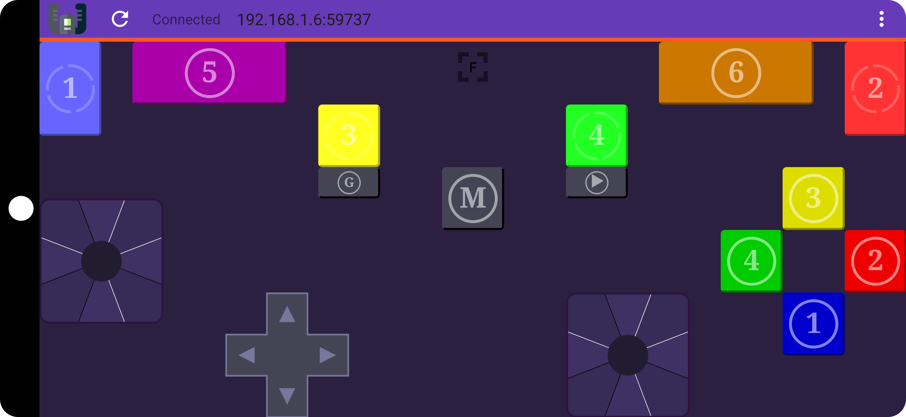

# Yoke (Android app)
> Yoke is a hackable Android gamepad for Linux (and Windows)
## How to build

See official instructions on
https://developer.android.com/studio/build/building-cmdline :

for example, on `Linux`,
```
./gradlew assembleDebug
```

[](https://f-droid.org/packages/com.simonramstedt.yoke/)

The most recent version is not on f-droid instead it is available on releases page of this repository




See https://github.com/uday-sudo/yoke-customized for more.
